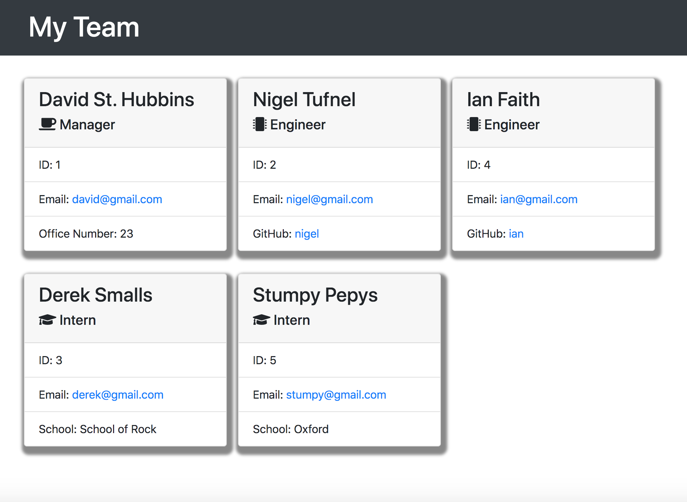

# Team Profile Generator
* A command line application for managing your employee contact info in an easy to read webpage.

## Description
* This is a Node.js application that allows users to answer a few questions about their employees and the application will generate a professional webpage with the employees' contact cards.

## Links
* https://github.com/taylornyquist/team-profile-generator

* [Link to Video](https://drive.google.com/file/d/1G-w3Ua4BUM5QDyMfq8Pah3PYd8JFhWRg/view)



## Table of Contents

* [Usage](#usage)
* [Installation](#installation)
* [Tests](#tests)
* [Run](#run)
* [Technology](#technology)
* [Questions](#questions)
* [Contribution](#contribution)

## Usage
Go to GitHub to clone the repo on your machine.

## Installation
To install necessary dependencies, run the following command:

```
npm install inquirer & npm install --save-dev jest
```

## Tests
To run tests, execute the following command:
```
npm run test
```

## Run
To run the application, execute the folloing command:
```
node index.js
```

## Technology
This application used the following technology:

* JavaScript
* Node.js
* Inquirer
* Jest
* CSS
* HTML

## Questions
If you have any questions about the repo, open an issue or contact me directly at tnyquist@gmail.com.  You can find more of my work at [taylornyquist](https://github.com/taylornyquist).


## Contribution
* Taylor Nyquist
